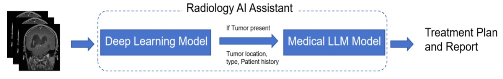
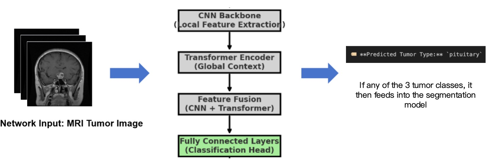
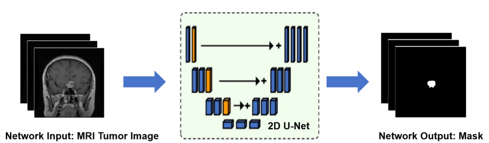
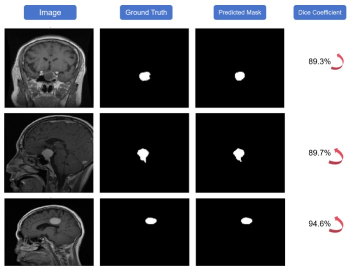
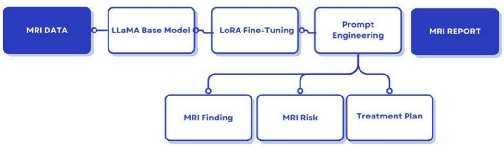

# AI-Powered Radiology Assistant



In this work, we implemented an AI-powered radiology assistant designed to automate brain tumor diagnosis through MRI image classification, segmentation, and structured report generation. The system features a two-stage deep learning pipeline that combines TransUNet for tumor classification and 2D-UNet for precise tumor segmentation. To enhance clinical interpretability, structured information such as tumor size, location, and mass effect is extracted from the segmentation masks. A fine-tuned LLaMA language model, optimized with LoRA, is then used to generate coherent and context-aware diagnostic reports. Prompt engineering strategies—including few-shot, instruction-based, and role-based prompting—further improve the quality and structure of the generated content. Evaluation results demonstrate high classification accuracy (0.94), strong segmentation performance (Dice 0.85, IoU 0.76), and significant gains in BLEU, ROUGE, and BERTScore for report generation. Our system delivers a robust end-to-end automated pipeline while reducing computational cost and enhancing clinical utility. Future work will focus on integrating follow-up recommendation mechanisms, multi-modal learning, and an interactive user interface to facilitate real-world clinical deployment.

---

## 🚀 Features

- **Tumor Classification**: TransUNet-based CNN + Transformer to detect and categorize tumors into four classes (No Tumor, Glioma, Meningioma, Pituitary).  
- **Tumor Segmentation**: 2D U-Net to generate precise binary masks of tumor regions.  
- **Structured Report Generation**: LoRA-fine-tuned LLaMA pipeline with prompt engineering (few-shot, instruction-based, role-based) to produce Findings, Risk Assessment, and Treatment Recommendations.  
- **Lightweight Deployment**: 4-bit quantized Llama, modular codebase, Gradio interface for interactive use.  
---

## 📂 Repository Structure

```text
AI-Powered-Radiology-Assistant/
├── README.md
├── LICENSE
├── requirements.txt
├── .gitignore
├── download_weights.py        # (optional) fetch model weights automatically
├── src/                       # all application code in one place
│   ├── __init__.py
│   ├── app.py                 # Gradio interface & main pipeline
│   ├── utils.py               # helper functions (model loading, downloads)
│   ├── classification/        # tumor classification module
│   │   ├── __init__.py
│   │   └── transunet.py       # TransUNetClassifier definition
│   ├── segmentation/          # tumor segmentation module
│   │   ├── __init__.py
│   │   └── unet.py            # build_unet, metrics (dice, iou)
│   └── report/                # report-generation logic
│       ├── __init__.py
│       └── generator.py       # extract_structured_info, LLM wrapper
└── notebooks/                 # Jupyter notebooks for training & experiments
    ├── Tumor_Classification_Transunet_code.ipynb
    ├── Tumor_Segmentation_code.ipynb
    ├── Generate_Reports.ipynb
    ├── LLM_Train_Model.ipynb
    └── Model_Performance_Comparison.ipynb
```

## Installation
1. Clone this repository:
```text
git clone https://github.com/your-username/AI-Powered-Radiology-Assistant.git
cd AI-Powered-Radiology-Assistant
```

2. Install Python dependencies:
```text
pip install -r requirements.txt
```

3. (Optional) Download pre-trained weights:
```text
python download_weights.py
```

## Usage
Launch the Gradio demo:
```text
python src/app.py
```
- Open the link in your browser.
- Upload a brain MRI scan.
- View classification result, segmentation mask, and AI-generated report.

## Screenshots & Diagrams
### 1. **Classification Pipeline**
— CNN + Transformer feature fusion for tumor type prediction.


### 2. **Segmentation Pipeline**  
— 2D U-Net encoder–decoder architecture.
  

### 3. **Sample Results**
— Example MRI slices, ground truth masks, predicted masks, Dice scores.
  

### 4. **Report Generation Flow** 
— LLaMA + LoRA + prompt engineering stages.
  

## Contributing
1. Fork the repository.
2. Create a feature branch:
```text
git checkout -b feature/your-feature-name
```
3. Commit your changes:
```text
git commit -m "Add [short description of feature]"
```
4. Push to your fork and open a Pull Request.

Please ensure that:
- Code follows PEP8 style conventions.
- Public APIs are documented with docstrings.
- New features include appropriate unit tests.

## License
This project is licensed under the MIT License. See the LICENSE file for details.

## Contact
Dexin Sun
- Email: ds4362@columbia.edu
Tianshuai Gao
- Email: tg2935@columbia.edu
- GitHub: tianshuai-gao/AI-Powered-Radiology-Assistant

